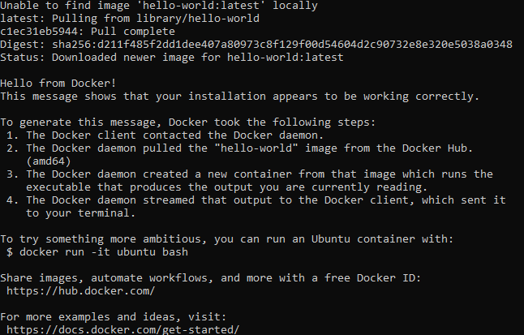

# Docker
## Tarea 1 INSTALACIÓN DE DOCKER

Para instalar docker seguimos los siguientes pasos

# Agregue la clave GPG oficial de Docker:
sudo apt-get update
sudo apt-get install ca-certificates curl
sudo install -m 0755 -d /etc/apt/keyrings
sudo curl -fsSL https://download.docker.com/linux/debian/gpg -o /etc/apt/keyrings/docker.asc
sudo chmod a+r /etc/apt/keyrings/docker.asc

# Agregue el repositorio a las fuentes de Apt:
echo \
  "deb [arch=$(dpkg --print-architecture) signed-by=/etc/apt/keyrings/docker.asc] https://download.docker.com/linux/debian \
  $(. /etc/os-release && echo "$VERSION_CODENAME") stable" | \
  sudo tee /etc/apt/sources.list.d/docker.list > /dev/null
sudo apt-get update

# Instalar los paquetes de Docker:
sudo apt-get install docker-ce docker-ce-cli containerd.io docker-buildx-plugin docker-compose-plugin

# Verifique que la instalación sea exitosa ejecutando la imagen de hello-world:
sudo docker run hello-world