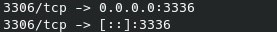

## 1. Obtener la Dirección IP del Contenedor web

docker inspect -f '{{range .NetworkSettings.Networks}}{{.IPAddress}}{{end}}' web

## 2. Obtener la Redirección de Puertos del Contenedor web

docker port web

## 3. Obtener la Dirección IP del Contenedor bbdd

docker inspect -f '{{range .NetworkSettings.Networks}}{{.IPAddress}}{{end}}' bbdd

## 4. Obtener la Redirección de Puertos del Contenedor bbdd

docker port bbdd

